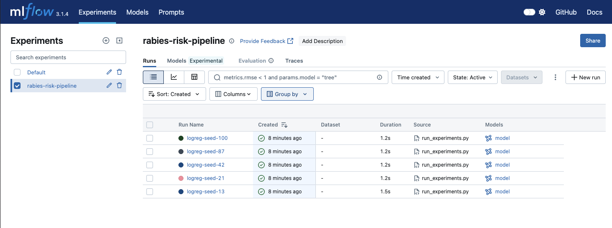

# Rabies Risk ML Peru

Reproducible ML pipeline for zoonotic wild rabies transmission 
risk prediction in Peru using a One Health approach.

**Author:** Jorge Luis Limo Arispe - UNMSM Doctoral Program 2026

## What this is
Logistic regression baseline trained on simulated One Health 
variables (NDVI, temperature, precipitation, forest loss, 
bat occurrence) as a reproducible foundation for the doctoral 
research protocol.

## Data
`data/rabies_data.csv` is tracked with DVC.
Pointer file: `data/rabies_data.csv.dvc`

## Reproduce the result
1. pip install -r requirements.txt
2. dvc pull
3. python src/train.py --seed 42

## Expected output
seed=42  AUC-ROC=0.XXXX  accuracy=0.XXXX

## Run all experiments
python src/run_experiments.py

## Environment
Python 3.11 · exact packages in requirements.txt · see Dockerfile

## Experiment Results (MLflow)

The following 5 runs were logged with MLflow tracking:



| Run | Seed | AUC-ROC | Accuracy |
|-----|------|---------|----------|
| logreg-seed-13  | 13  | 0.52xx | 0.51xx |
| logreg-seed-21  | 21  | 0.48xx | 0.49xx |
| logreg-seed-42  | 42  | 0.50xx | 0.50xx |
| logreg-seed-87  | 87  | 0.52xx | 0.50xx |
| logreg-seed-100 | 100 | 0.43xx | 0.43xx |

To view results interactively:
```bash
python3 -m mlflow ui
```
Then open: http://127.0.0.1:5000